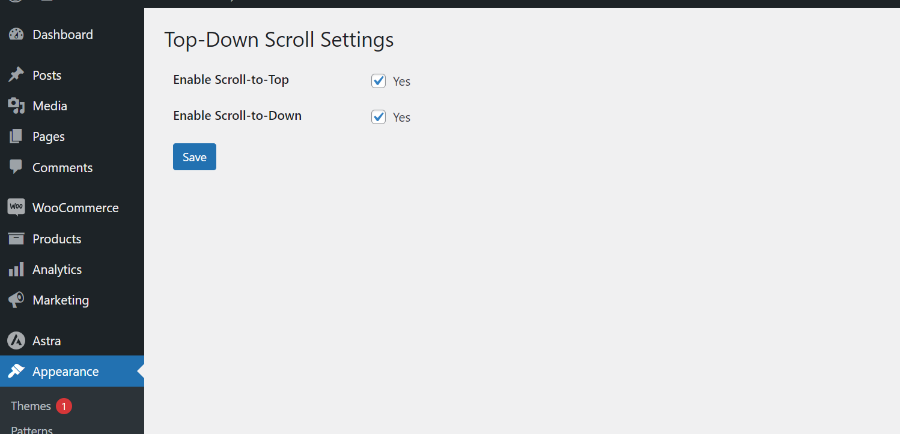

# Top-Down Scroll

This plugin adds a customizable scroll-to-top and scroll-to-bottom button on your WordPress website. With this plugin activated, users can easily navigate to the top or bottom of the page with just a click, enhancing user experience and navigation on your site.

